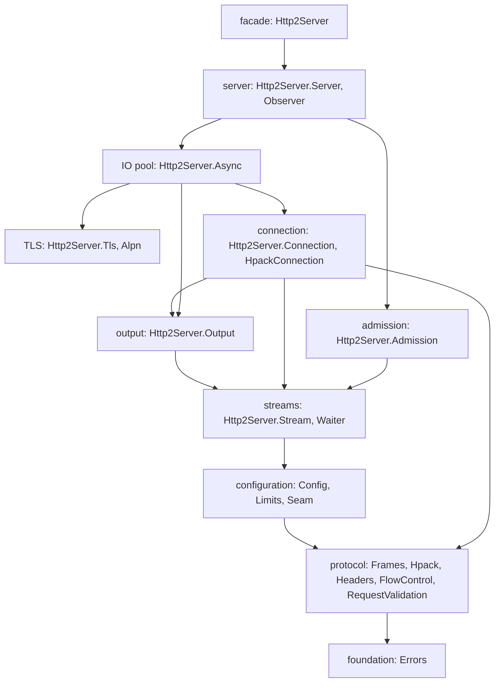

{**
---
license: TBD-LICENCE
copyright: Copyright 2026 Liam Seamus Coughlin
keywords: http2, server, architecture, threading, seam, units, mormot
notes:
  - This document holds the shape of the whole library and the growth of the
    code. It points at the documents that hold each part in full.
scope: The layers of the library, the two thread pools with the cancel workers, the seam between the sides, the unit layout and the growth of the code.
primary_types:
  - THttp2ServerFactory
  - IHttp2Server
  - IHttp2Handler
  - TServerConnectionCore
  - IStreamWaiter
db_tables: []
related_docs:
  - doc/design/threading.md
  - doc/design/seam.md
  - doc/design/connection.md
  - doc/design/io-pool.md
  - doc/design/public-api.md
  - doc/design/future-coroutines.md
  - doc/README.md
invariants:
  - An IO thread never runs a handler.
  - A handler thread never holds the connection lock across a wait.
  - The seam carries bytes and no text encoding.
  - The HPACK codec runs on an IO thread only.
  - Every layer below the facade is usable without a socket, except the IO pool and the TLS units.
---

# Architecture

The library is an HTTP/2 server for Free Pascal and mORMot2. It speaks HTTP/2
over clear text with prior knowledge (`h2c`) and over TLS with the ALPN name
`h2` (RFC 9113 section 3). The unit `src/Http2Server.pas` is the facade.

The design rests on one separation. A few IO threads run the protocol of many
connections and never block. A larger set of handler threads runs the code of
the caller and may block. The seam between the two sides is narrow, and the
document [seam](seam.md) holds it.

## The layers

A caller builds a `THttp2ServerFactory`, adds a handler, and calls `Build`.
The result is an `IHttp2Server` that binds a port and answers requests. The
document [public-api](public-api.md) holds the surface, and
[configuration](configuration.md) holds every setting.

## The thread model

The server runs three kinds of thread.

| Kind | Count | Work |
| --- | --- | --- |
| IO thread | one per IO pool thread | sweeps connections with a non-blocking lock, reads and writes frames, runs HPACK |
| handler thread | one per handler pool thread | runs one synchronous handler per request |
| cancel worker | one per cancel pool thread | runs the cancel hooks of cancelled streams |

The IO pool is the async server of mORMot2. It owns the poller of the
platform, `epoll` on Linux and `poll` on macOS, and it calls the connection
callback from an IO thread when a socket becomes ready. The server builds no
poller of its own. The document [io-pool](io-pool.md) holds the integration.

The handler side is a fixed pool with one bounded admission queue in front of
it. The document [admission](admission.md) holds the queue, the refusal modes
and the counters.

The two sides meet at the seam. A handler reads and writes bytes through
`IServerRequest` and `IServerResponse`, and it waits through `IStreamWaiter`.
The seam carries no HTTP structure across, so the handler never touches the
HPACK encoder and never builds a frame. The document [threading](threading.md)
holds the rules that keep the kinds apart.

## The path of one request

The path shows how the layers cooperate.

1. An IO thread accepts the socket and the connection core consumes the
   preface. The core sends the server SETTINGS frame
   (`src/Http2Server.Connection.pas:363`).
2. A `HEADERS` frame starts a header block and `CONTINUATION` frames extend
   it. The HPACK decoder runs on the IO thread under the connection lock.
3. The core validates the request fields against RFC 9113 section 8.1. An
   invalid block sends `RST_STREAM` with `PROTOCOL_ERROR` and the stream ends.
4. A valid request enters the admission queue. A full queue refuses the
   request with `REFUSED_STREAM` or a 503 response.
5. A handler thread takes the request and runs the handler. A read that finds
   no buffered bytes parks on the stream waiter and releases every lock first.
6. The handler builds a plain header list and writes the body. The IO thread
   encodes the header list and drains the body into `DATA` frames that obey
   the flow-control windows and the peer frame size.
7. The handler returns. The core closes the stream once the last holder
   releases it. The document [connection](connection.md) holds the whole path.

## The unit layout

Every unit uses the prefix `Http2Server.`. The copied client units keep the
same prefix, so a program links the client library and the server library
together with no name clash.

| Unit | Lines | Layer | Responsibility |
| --- | --- | --- | --- |
| `Http2Server.pas` | 146 | facade | the public surface, re-exported from the units below |
| `Http2Server.Server.pas` | 182 | server | `THttp2Server`, the start and stop path |
| `Http2Server.Observer.pas` | 121 | server | the events, the observer and the statistics |
| `Http2Server.Async.pas` | 791 | IO | the mORMot2 async subclasses and the core bridge |
| `Http2Server.Tls.pas` | 176 | TLS | the `INetTls` plug-in of a connection |
| `Http2Server.Alpn.pas` | 276 | TLS | the `SSL_CTX_set_alpn_select_cb` binding and callback |
| `Http2Server.Admission.pas` | 897 | admission | the bounded queue and the handler pool |
| `Http2Server.Connection.pas` | 1193 | connection | the connection core |
| `Http2Server.HpackConnection.pas` | 229 | connection | the HPACK encoder and decoder of one connection |
| `Http2Server.Output.pas` | 283 | output | the response path and the drain |
| `Http2Server.Stream.pas` | 869 | streams | the stream state, the buffers and the reference count |
| `Http2Server.Waiter.pas` | 408 | streams | the blocking waiter and the cancel worker pool |
| `Http2Server.Config.pas` | 687 | configuration | the factory record and the option records |
| `Http2Server.Limits.pas` | 383 | configuration | the token buckets and the clock |
| `Http2Server.Seam.pas` | 201 | configuration | the interfaces the handler sees |
| `Http2Server.Frames.pas` | 886 | protocol | the frames, the settings and the error codes |
| `Http2Server.Hpack.pas` | 800 | protocol | the HPACK codec |
| `Http2Server.Headers.pas` | 254 | protocol | the header names and the header list |
| `Http2Server.FlowControl.pas` | 300 | protocol | the connection and stream windows |
| `Http2Server.RequestValidation.pas` | 204 | protocol | the RFC 9113 section 8.1 field rules |
| `Http2Server.Errors.pas` | 135 | foundation | the error codes and the exception classes |

The five units `Errors`, `Frames`, `Hpack`, `Headers` and `FlowControl` come
from the sibling client. The server changes them at the edges only, and the
document [protocol](protocol.md) records each change.

The core of the library holds no socket. `TServerConnectionCore`,
`TServerStream`, `TOutputDrain`, `TFlowControl` and the protocol units run in
a test with no network, and the per-connection HPACK state has its own unit
`Http2Server.HpackConnection.pas` for that reason.

## The growth of the code

The code grew one layer at a time, and each layer wrote its documents in the
same commit as its code. The tree reached its present shape through the
following steps.

1. The TLS route reached ALPN through the mORMot2 TLS interface and one
   OpenSSL callback (`src/Http2Server.Tls.pas`, `src/Http2Server.Alpn.pas`).
2. The protocol units were copied and given the server edges.
3. The settings moved into one immutable factory record.
4. The token buckets arrived with an injected clock.
5. The seam and the streams arrived.
6. The connection core arrived.
7. The output path arrived.
8. The admission queue and the handler pool arrived.
9. The core moved onto the mORMot2 async IO pool.
10. The lifecycle, the observer and the facade arrived.
11. The RFC 9113 rules and the validation evidence arrived.

A later change can replace the blocking waiter with a coroutine scheduler
without a change to the seam. The document
[future-coroutines](future-coroutines.md) holds the deferred option and the
research result.

## Where a reader continues

| Reader | Next document |
| --- | --- |
| a caller of the library | [public-api](public-api.md), then [configuration](configuration.md) |
| a maintainer of a layer | [threading](threading.md), then the document of the layer |
| a reader of the conformance record | [validation](../verification/validation.md) |
| a reader of the build and the platform | [toolchain](../verification/toolchain.md) |
