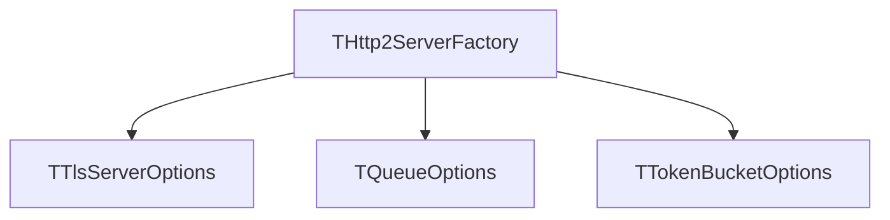

{**
---
license: TBD-LICENCE
copyright: Copyright 2026 Liam Seamus Coughlin
keywords: http2, server, config, factory, options, tls, queue
notes:
  - The factory and the option records of the server.
  - Every server setting passes through the factory. Create holds the only
    block of defaults.
scope: The factory record, the option records it carries, and the validation rules.
primary_types:
  - THttp2ServerFactory
  - TTlsServerOptions
  - TQueueOptions
  - TQueueRefusalMode
db_tables: None.
related_docs:
  - doc/design/limits.md
  - doc/design/protocol.md
  - doc/design/tls.md
invariants:
  - A WithX call returns a new record and never changes the record it was
    called on.
  - The numeric defaults of the server exist in one place, the body of
    THttp2ServerFactory.Create, and in the Create bodies of the two option
    records.
  - Validate reports every problem in one call.
---
}
# Configuration

Every setting of the HTTP/2 server passes through one object: the server
factory. The factory is a record with a fluent interface, in the same form as
the client factory of the sibling project. A `WithX` method returns a new
record with one field changed. The record that the method was called on keeps
its value, so a stored factory is safe to copy and to fork.

## The factory record

`THttp2ServerFactory` is a record (`src/Http2Server.Config.pas:116`). Its
fields are private and its properties are read-only, so a caller changes a
setting only through a `WithX` method.

`Create` is a static class function that returns the record with the defaults
(`src/Http2Server.Config.pas:391`). The defaults appear once, in that body.
The two option records hold their own defaults in their own `Create` bodies
(`src/Http2Server.Config.pas:312`, `src/Http2Server.Config.pas:362`). The
figure below shows the three records and their relation.

The factory is the home of every server setting. The protocol units hold the
protocol bounds instead: `MinAllowedFrameSize` and `MaxAllowedFrameSize`
(`src/Http2Server.Frames.pas:42`, `src/Http2Server.Frames.pas:44`), and
`MaxWindowSize` (`src/Http2Server.FlowControl.pas:28`). A connection reads the
remaining values from a settings record that the factory fills, as the
connection core states for `TConnectionCoreOptions`
(`src/Http2Server.Connection.pas:36-40`).

The test `TestDefaultsOnlyInCreate` reads the source of this unit and fails on
a numeric literal of two digits or more outside a `Create` body
(`test/Http2Server.Config.Test.pas:754`). The same rule for the other units is
not yet testable: `Http2Server.Stream.pas`, `Http2Server.Connection.pas` and
`Http2Server.Waiter.pas` still hold placeholder constants of their own. Those
constants move into the factory as each unit starts to read the factory. A
whole-tree sweep is the check for that later state.

### The listener settings

| Setting | `WithX` | Meaning |
|---|---|---|
| `Host` | `WithHost` | the address of the listener, such as `0.0.0.0` or `::1` |
| `Port` | `WithPort` | the TCP port; 0 asks the operating system for a free port |
| `Backlog` | `WithBacklog` | the length of the listen backlog |
| `ClearTextAllowed` | `WithClearTextAllowed` | allows cleartext HTTP/2 (h2c prior knowledge); off by default |

The listener settings are declared at `src/Http2Server.Config.pas:149-159`.

### The TLS settings

`TTlsServerOptions` is a record with its own fluent methods
(`src/Http2Server.Config.pas:55`). `THttp2ServerFactory.WithTls` accepts the
record whole (`src/Http2Server.Config.pas:466`).

| Setting | `WithX` | Meaning |
|---|---|---|
| `CertificateFile` | `WithCertificateFile` | the path of the PEM certificate file |
| `KeyFile` | `WithKeyFile` | the path of the PEM private key file |
| `KeyPassword` | `WithKeyPassword` | the password of an encrypted key, or an empty string |
| `AlpnProtocols` | `WithAlpnProtocols` | the ALPN protocol names, in preference order |
| `HandshakeTimeoutMs` | `WithHandshakeTimeoutMs` | the time a handshake may take |

The default ALPN list holds the single name `h2`
(`src/Http2Server.Config.pas:314-321`). `doc/design/tls.md` describes how the
ALPN name reaches OpenSSL.

### The pool settings

| Setting | `WithX` | Meaning |
|---|---|---|
| `IOThreads` | `WithIOThreads` | the number of IO pool threads |
| `HandlerThreads` | `WithHandlerThreads` | the number of handler pool threads |
| `CancelWorkerThreads` | `WithCancelWorkerThreads` | the number of threads that run the cancel hooks |

A cancel hook runs at most once, never on the thread that called `Cancel`
(`src/Http2Server.Seam.pas:64-70`). The count of cancel workers decides how many
hooks run at the same time.

### The queue settings

`TQueueOptions` is a record with its own fluent methods
(`src/Http2Server.Config.pas:90`). `THttp2ServerFactory.WithQueue` accepts the
record whole (`src/Http2Server.Config.pas:494`).

| Setting | `WithX` | Meaning |
|---|---|---|
| `Depth` | `WithDepth` | the greatest number of requests that wait for a handler |
| `MaxWaitMs` | `WithMaxWaitMs` | the greatest wait of a queued request |
| `RefusalMode` | `WithRefusalMode` | the action when the queue is full |

`TQueueRefusalMode` has two values (`src/Http2Server.Config.pas:44`). The
value `rmRefuseStream` resets the stream with `REFUSED_STREAM`. The value
`rmHttp503` answers HTTP 503. The two answers differ in the retry rule. RFC
9113 §5.1.2 states that the error code decides whether automatic retry is
enabled (RFC 9113, section 5.1.2, read 2026-10-07).

A depth of 0 is legal. With depth 0 no request waits, so every request beyond
the free handlers is refused at once.

### The stream settings

| Setting | `WithX` | Meaning |
|---|---|---|
| `MaxConcurrentStreams` | `WithMaxConcurrentStreams` | `SETTINGS_MAX_CONCURRENT_STREAMS` of one connection |
| `InitialStreamWindow` | `WithInitialStreamWindow` | `SETTINGS_INITIAL_WINDOW_SIZE` of every new stream |
| `InitialConnectionWindow` | `WithInitialConnectionWindow` | the initial flow-control window of the connection |
| `MaxFrameSize` | `WithMaxFrameSize` | `SETTINGS_MAX_FRAME_SIZE` that the server accepts |
| `MaxHeaderListSize` | `WithMaxHeaderListSize` | `SETTINGS_MAX_HEADER_LIST_SIZE` that the server accepts |
| `MaxContinuationFrames` | `WithMaxContinuationFrames` | the greatest count of `CONTINUATION` frames in one header block |
| `HeaderTableSize` | `WithHeaderTableSize` | `SETTINGS_HEADER_TABLE_SIZE` of the HPACK codecs |

The stream settings are declared at `src/Http2Server.Config.pas:185-206`. The
protocol limits come from the protocol units, not from the factory:
`MinAllowedFrameSize` and `MaxAllowedFrameSize`
(`src/Http2Server.Frames.pas:42`, `src/Http2Server.Frames.pas:44`), and
`MaxWindowSize` (`src/Http2Server.FlowControl.pas:28`). A connection uses the
settings in `TConnectionSettings` (`src/Http2Server.Frames.pas:94`).

### The bucket limits

The factory holds one `TTokenBucketOptions` per limited client action: the
reset bucket and one bucket per control frame kind
(`src/Http2Server.Config.pas:134-139`). Each bucket has its own `WithX`
method (`src/Http2Server.Config.pas:557-600`). `TTokenBucketOptions` is the
fluent record of `src/Http2Server.Limits.pas:71`; `doc/design/limits.md`
describes the bucket itself.

| Bucket | `WithX` | The client action it bounds |
|---|---|---|
| reset | `WithResetBucket` | `RST_STREAM`, the rapid-reset technique of CVE-2023-44487 |
| ping | `WithPingBucket` | `PING` |
| settings | `WithSettingsBucket` | `SETTINGS` |
| empty data | `WithEmptyDataBucket` | `DATA` with no payload |
| window update | `WithWindowUpdateBucket` | `WINDOW_UPDATE`, the tiny-increment technique of RFC 9113 section 10.5 |
| continuation | `WithContinuationBucket` | `CONTINUATION`, the flooding technique of CERT VU#421644 |

The reset bucket has two costs. `CostBeforeDispatch` applies to a reset before
a handler runs, and `CostAfterDispatch` applies to a reset after a handler
runs (`src/Http2Server.Limits.pas:224`). The other buckets take their cost
from the caller of `TryTake`.

### The timeout settings

| Setting | `WithX` | Meaning |
|---|---|---|
| `IdleTimeoutMs` | `WithIdleTimeout` | the time an idle connection stays open |
| `HeaderTimeoutMs` | `WithHeaderTimeout` | the time the header block of a request may take |
| `GracefulStopTimeoutMs` | `WithGracefulStopTimeout` | the time a graceful stop waits for the open streams |

The timeout settings are declared at `src/Http2Server.Config.pas:229-237`.

### The wiring

| Setting | `WithX` | Meaning |
|---|---|---|
| `Handler` | `WithHandler` | the handler that serves every request; required |
| `Clock` | `WithClock` | the clock of the token buckets and of the timeouts |

The wiring is declared at `src/Http2Server.Config.pas:239-244`. `IHttp2Handler`
is the handler contract (`src/Http2Server.Seam.pas:150`). `IMonotonicClock` is the
clock interface, and `TMonotonicClock` is its real implementation
(`src/Http2Server.Limits.pas:40`, `src/Http2Server.Limits.pas:47`). `Create`
builds the default clock, so a caller sets no clock for a normal server.

## Validation

`Validate(out AProblems: TArray<string>): Boolean` collects every problem of
the settings into one list (`src/Http2Server.Config.pas:627`). The answer is
`True` and the list is empty when every setting is correct. The answer is
`False` and the list holds one message per problem when a setting is wrong.
The method does not stop at the first problem.

The rules are:

| Rule | Problem message |
|---|---|
| the port is 0 to 65535 | the port is outside the range |
| the backlog is at least 1 | the listen backlog is below 1 |
| the IO thread count is at least 1 | the IO thread count is below 1 |
| the handler thread count is at least 1 | the handler thread count is below 1 |
| the cancel worker count is at least 1 | the cancel worker count is below 1 |
| the queue depth is at least 0 | the queue depth is below 0 |
| the maximum queue wait is at least 0 | the maximum queue wait is below 0 |
| the certificate file is present when cleartext is off | the certificate file is empty |
| the key file is present when cleartext is off | the key file is empty |
| the frame size is 16384 to 16777215 | the frame size is outside the range |
| the initial stream window is at most 2^31-1 | the stream window is above the limit |
| the initial connection window is at most 2^31-1 | the connection window is above the limit |
| the handler is assigned | the handler is not assigned |

Port 0 is legal, and it asks the operating system for a free port. The
certificate and the key are not required when `ClearTextAllowed` is set, as
`TestValidateCleartextNeedsNoCertificate` shows
(`test/Http2Server.Config.Test.pas:376`).

A caller that builds a server raises `EServerConfigError` when `Validate`
answers `False` (`src/Http2Server.Errors.pas:79`). The message holds the whole
problem list, so one exception names every problem.

## Default values

The default values of the server are placeholders. Load tests set them later.
The values are:

| Group | Defaults |
|---|---|
| Listener | host `0.0.0.0`, port 8443, backlog 128, cleartext off |
| TLS | no certificate, no key, no password, ALPN `h2`, handshake timeout 10000 ms |
| Pools | 4 IO threads, 8 handler threads, 2 cancel workers |
| Queue | depth 64, maximum wait 5000 ms, refusal by `REFUSED_STREAM` |
| Streams | 100 concurrent streams, 65535 stream window, 65535 connection window, 16384 frame size, 65536 header list size, 16 `CONTINUATION` frames, 4096 header table |
| Buckets | reset bucket 1000 tokens with a refill of 100 per second and costs 1 and 5; each control bucket 100 tokens with a refill of 10 per second |
| Timeouts | idle 60000 ms, header 30000 ms, graceful stop 10000 ms |
| Wiring | no handler, the process monotonic clock |

## What the factory does not hold

The factory holds no `Build` method in this release. `Build` returns an
`IHttp2Server`, and the server interface arrives with the server lifecycle
unit. The factory holds the settings that `Build` reads.

The factory holds no observer. The observer interface arrives with the
observer unit, and the factory refers to it once that unit exists.

## Verification

The unit tests are in `test/Http2Server.Config.Test.pas` and run in the normal
suite. They cover the defaults, the immutability rule of every `WithX`, the
validation rules one by one, a validation call that reports several problems,
and the source rule that keeps a numeric default inside a `Create` body.

Two behaviours need a running server and are not part of this document's
evidence: the bound port, and the refusal action of a full queue. The server
lifecycle and admission work covers both against the finished server.
